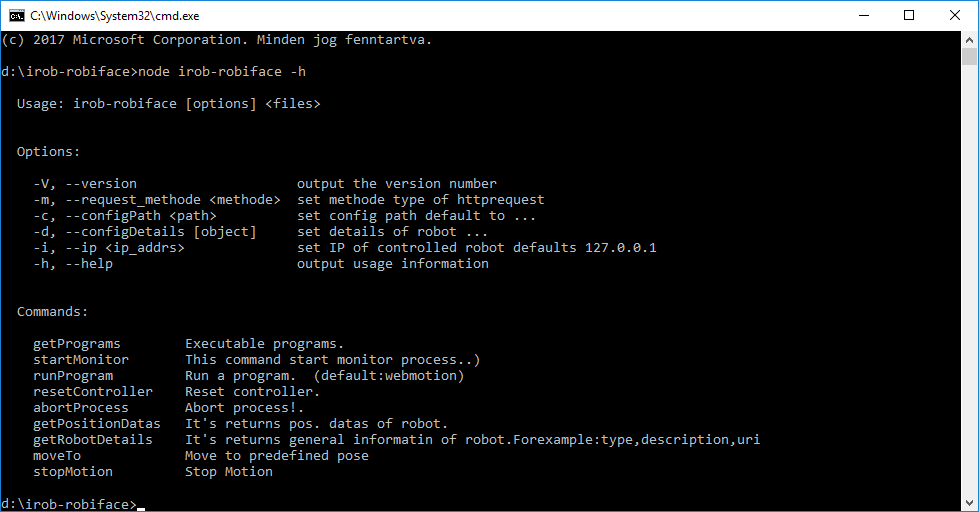

# irob-robiface

## Overview
Simple command line tool (software) to control FANUC six degree of freedom robotic arms.

<!--  -->

<figure id='figure_1'>
  
  <figcaption>1. While using the app</figcaption>
</figure>

**NOTE**: It is an experimental software. Do not use this in production systems!

THE SOFTWARE IS DISTRIBUTED IN THE HOPE THAT IT WILL BE USEFUL, BUT WITHOUT ANY WARRANTY. IT IS PROVIDED "AS IS" WITHOUT WARRANTY OF ANY KIND, EITHER EXPRESSED OR IMPLIED, INCLUDING, BUT NOT LIMITED TO, THE IMPLIED WARRANTIES OF MERCHANTABILITY AND FITNESS FOR A PARTICULAR PURPOSE. THE ENTIRE RISK AS TO THE QUALITY AND PERFORMANCE OF THE SOFTWARE IS WITH YOU. SHOULD THE SOFTWARE PROVE DEFECTIVE, YOU ASSUME THE COST OF ALL NECESSARY SERVICING, REPAIR OR CORRECTION.

## TOC
1. [Requirements](#requirements)
2. [Installation](#installation)
3. [Configuration](#configuration)
4. [How use it](#example-usage)
5. [Notes](#notes)
6. [Acknowledgement](#acknowledgement)
7. [Bugs, feature requests, etc](#bugs-feature-requests-etc)

## Requirements
This is written in Javascript (ECMAScript 2017 (ECMA-262)) and based on Node.js®, therefore important if you want to use it, you should have node and npm, and you should know what it is.

Furthermore, since this application is based on ABC-iRobotics/fanuc-webcontrol and uses some of its scripts.

Necessary to look at the description :
[ABC-iRobotics/fanuc-webcontrol](https://github.com/ABC-iRobotics/fanuc-webcontrol).

## Installation
Download the files to an arbitrary location, then run CMD from the root directory, and that's all, you can use it.

## Configuration

No need configure. Because its pre-configured for a specific type of Fanuc robot( type:M-430iA2P ).

## How use it

You can use the following commands ( in the CMD ):

Important: the command syntax
 - node irob-robiface [option] <files>  
 <i><b>Forexample</b></i>: <b>node irob-robiface getPrograms  Webmotion </b>

If you want to know which options can you choose, write in the command line this command:
  - node irob-robiface -h

  This command lists executable commands, and other general information ( See figure: [figure 1](#figure_1)) .
<!-- 
|      |   |   |   |   |
|------|---|---|---|---|
|      |   |   |   |   |
|      |   |   |   |   |
|      |   |   |   |   | -->

  Available options :
  <table>
  
  <tr >
    <td>
      getPrograms : 
    </td>
    <td style="text-indent:10px,text-align: justify;
    text-justify: inter-word;">
      Lists executable programs ( what programs are on the robot.
    </td>
  </tr>

  <tr>
    <td>
    startMonitor :
    </td>
    <td style="text-indent:10px,text-align: justify;
    text-justify: inter-word;">
      Start the monitor process. 
    </td>
  </tr>
  
  <tr>
    <td>
      runProgram : 
    </td>
    <td style="text-indent:10px,text-align: justify;
    text-justify: inter-word;">
      Run a program.
    </td>
  </tr>
  
  <tr>
    <td>
      resetController : 
    </td>
    <td style="text-indent:10px,text-align: justify;
    text-justify: inter-word;">
      Reset robot controller.
    </td>
  </tr>
  
  <tr>
    <td>
      abortProcess : 
    </td>
    <td style="text-indent:10px,text-align: justify;
    text-justify: inter-word;">
      Abort process.
    </td>
  </tr>
  
  <tr>
    <td>
      getpositionDatas:
    </td>
    <td style="text-indent:10px,text-align: justify;
    text-justify: inter-word;">
      It's returns pos. datas of robot. 
    </td>
  </tr>

  <tr>
    <td>
      getRobotDetails : 
    </td>
    <td style="text-indent:10px,text-align: justify;
    text-justify: inter-word;">
     It's returns general information of robot.
      <b>Forexample:</b></u> type,description, ur
     </td>
  </tr>
  <tr>
    <td>
      moveTo : 
    </td>
    <td style="text-indent:10px,text-align: justify;
    text-justify: inter-word;">
     Move to a predefined position.
  </tr>

  <tr>
    <td>
      stopMotion : 
    </td>
    <td style="text-indent:10px,text-align: justify;
    text-justify: inter-word;">
     Stop motion.
  </tr>
  </table>
   

Then if you choose from the options, forexample you want to know what programs are on the robot control.

<u>You just type this:</u>
 node irob-robiface getPrograms

## Notes

1. The predefined positions were tested on FANUC M-430iA2P. If you have an other type of FANUC robot, you might have to change these positions' coordinates.

## API

## Acknowledgement

## Bugs, feature requests, etc
Please use the [GitHub issue tracker][].

[GitHub issue tracker]: https://github.com/JSJQDEVELOP/irob-robiface/issues

## License

MIT. See LICENSE for details.